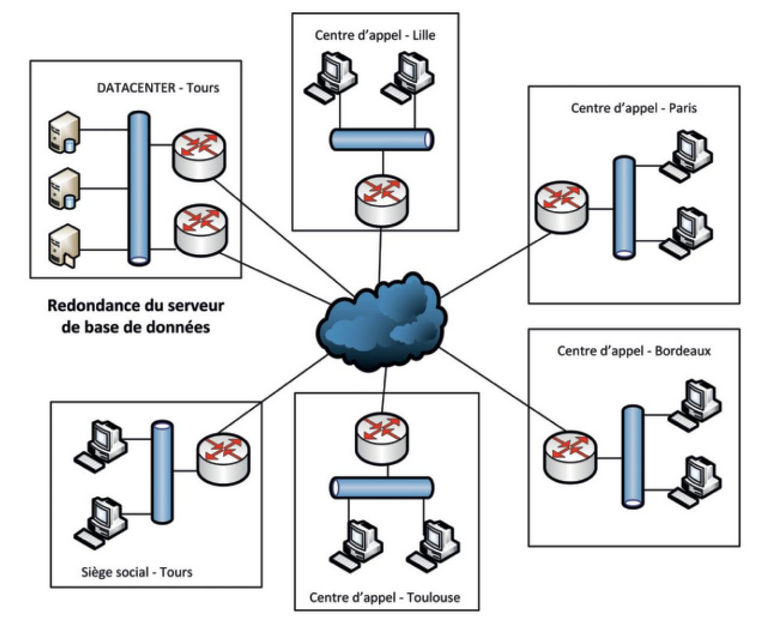
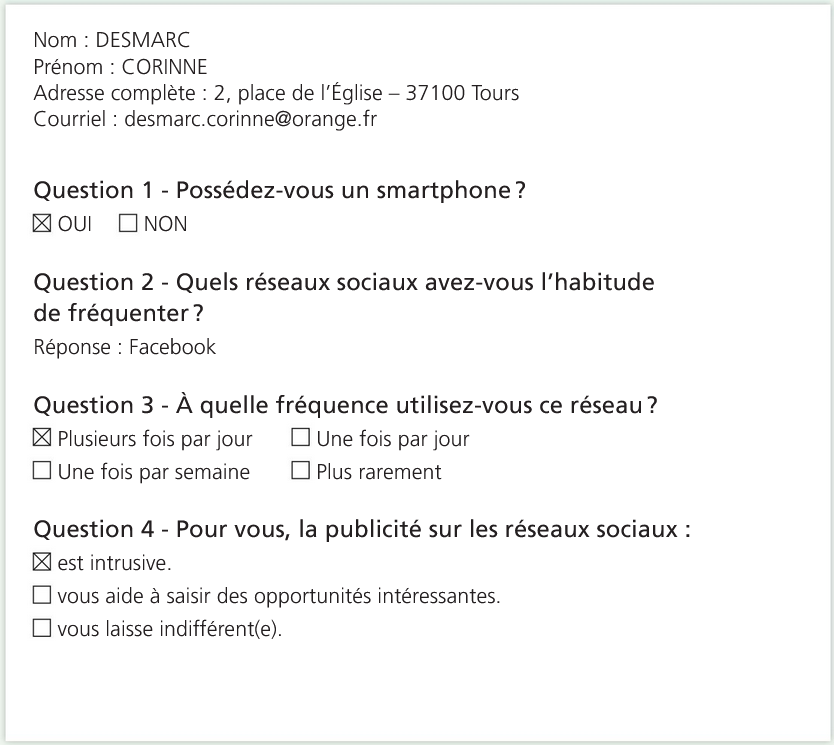
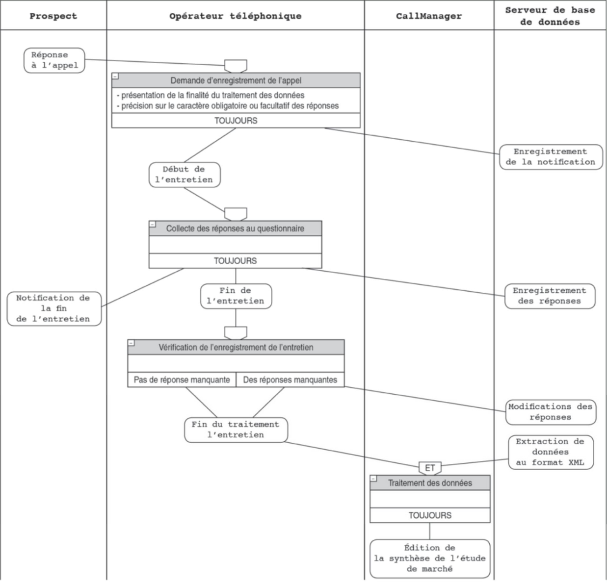
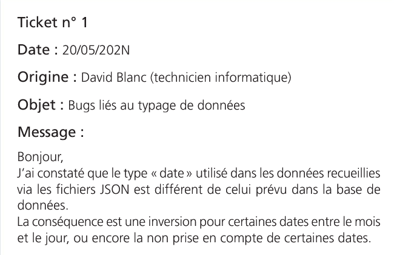
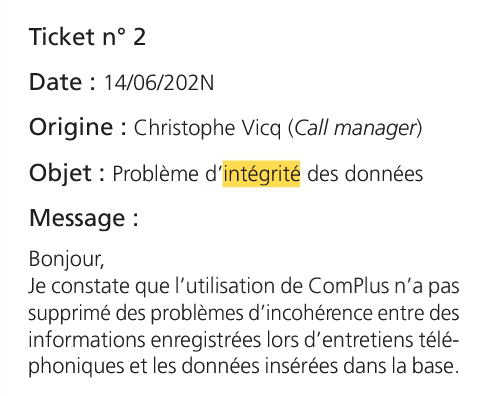
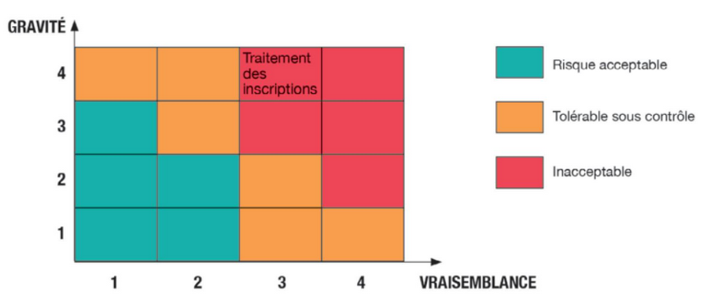

# Protection des données à caractère personnel (DCP)

## Contexte

### L'organisation

Fondée en 1993, l'entreprise KLIENTE compte cinq centres d'appels implantés dans des grandes villes de France : Lille, Paris, Tours, Bordeaux et Toulouse. Son siège social se situe à Tours, dans des locaux de 500 m².
Les centres d'appel sont des plateformes qui réalisent l'accueil téléphonique ou des démarches de télémarketing pour le compte d'entreprises clientes. En confiant l'externalisation de ces services à KLIENTE, ces entreprises peuvent se concentrer sur leur coeur de métier.

### Le prestataire informatique

La DSI est installée dans les bâtiments du siège social de KLIENTE. Elle est organisée en trois pôles de compétences :

- le pôle _Infrastructures et serveurs_ a pour activités principales le paramétrage et la sécurisation des éléments d'interconnexion et des serveurs
- le pôle _Applications_ est dédié au développement d'applications spécifiques pour les besoins de KLIENTE
- le pôle _Données à caractère personnel et données sensibles_ a pour mission de veiller à l'identification des risques et au respect de la législation sur les DCP

### Description du SI de l'organisation

L'infrastructure informatique de KLIENTE s'organise de la manière suivante :

- l'ensemble des sites est interconnecté par une liaison VPN
- KLIENTE assure une continuité des accès à ses serveurs via une redondance de ses éléments d'interconnexion
- la redondance des serveurs de base de données assure la continuité des accès aux données stockées, notamment aux DCP

### Cahier des charges

Les activités de KLIENTE la conduise à appliquer une politique rigoureuse en matière de protection des DCP. Celle-ci doit répondre à quatre objectifs majeurs :

- le recensement des traitements des DCP au sein de l'organisation, notamment lors des études de marché réalisées pour le compte des clients
- l'identification des risques liés aux traitements des DCP durant le processus d'une étude de marché
- la vérification du respect de la législation en matière de traitement et de conservation des DCP
- la sensibilisation des différents acteurs (opérateurs téléphoniques, managers, etc.) à la protection des DCP

### Mission

Vous êtes accueilli au sein du pôle _DCP et données sensibles_. Vous participez à différentes missions destinées à assurer la protection des DCP collectées par KLIENTE.

## Situation

Depuis quelques mois, KLIENTE observe une forte croissance de la demande de ses clients pour la réalisation d'études de marché. Sur cette même période, des incidents ont été constatés : perte ou divulgation de données dont certaines sont à caractère personnel. Ces incidents peuvent avoir des conséquences catastrophiques pour la réputation de KLIENTE et engendrer des pertes financières importantes.

On vous demande de recenser les traitements réalisés lors du processus d'étude de marché afin de mieux identifier les risques qui pèsent sur la protection des DCP.

## 1. Recensement des traitements sur les DCP

Le traitement des DCP liées à la réalisation d'études de marché doit être conforme avec les directives de la CNIL. On vous demande d'aider vos collègues à identifier les DCP et à recenser les traitements réalisés.
Pour cette mission, vous devez prendre en compte les contraintes spécifiques en matière de traitement des données qui pèsent sur les centres d'appel de KLIENTE.

### À faire

Note : les documents associés sont présentés plus bas.

1. (Doc. 1) **Identifiez les DCP parmi celles recueillies lors de la réalisation d'une étude de marché. Justifiez votre réponse.**

Après réception de l'accord oral de la personne interrogée, les opérateurs du centre d'appel peuvent enregistrer la conversation téléphonique afin de ne pas commettre d'erreurs dans la collecte des informations. Dans ce cas, les opérateurs précisent la finalité de l'enregistrement.

2. En vous documentant sur le site de la CNIL, **analysez la conformité de la situation décrite ci-dessus avec les directives de la CNIL.**

Un de vos collègue de l'équipe informatique a schématisé le processus de gestion des appels téléphoniques pour la réalisation d'une étude de marché. Il a également réalisé un tableau permettant de lister les opérations effectuées sur les DCP tout au long de ce processus.

3. (Doc. 2, 3) **Complétez le tableau de recensement des opérations réalisées lors d'une étude de marché chez KLIENTE.**

KLIENTE désire mobiliser plusieurs canaux (par exemple : courriel, téléphone et SMS) pour sa collecte de données. L'application ComPlus SMS (doc. 6) est actuellement testée pour accompagner cette démarche. Certains incidents sont malheureusement déjà remontés.

4. (Doc. 4, 5, 6) **Repérez les difficultés rencontrées avec la nouvelle application. Précisez en quoi elles contribuent à affaiblir la protection des DCP.**

### Document 1 - Extrait des données recueillies lors d'une étude de marché

Un client de KLIENTE souhaite recueillir des données sur les attentes du marché de la publicité relatives aux réseaux sociaux. Voici un extrait du questionnaire :

### Document 2 - Tableau de recensement des opérations réalisées pour une étude de marché

| Opération                 | Référence | Finalité          | Catégories de DCP concernées | Catégories de personnes concernées | Destinataires             |
| ------------------------- | --------- | ----------------- | ---------------------------- | ---------------------------------- | ------------------------- |
| Enregistrement d'un appel | OP-01     | Preuve de l'appel | Vie personnelle              | Prospect                           | Client et service interne |
| ...                       | ...       |                   |                              |                                    |                           |

### Document 3 - Processus de réalisation d'une étude de marché chez KLIENTE

**Exemple de lecture d'une opération** : la demande d'autorisation d'enregistrement d'un appel précède toujours l'enregistrement de l'acceptation de la personne interrogée et le début de l'entretien.

### Document 4 - KLIENTE, un centre d'appel multicanal

L'appreillage des clients et la facilité d'accès à certaines informations via Internet oblige KLIENTE à une transformation digitale. Le client peut établir le contact par courriel, puis par un appel téléphonique pour enfin suivre l'évolution de sa demande sur une app mobile. KLIENTE doit accompagner ce changement en adoptant le multicanal : les plateformes des centres d'appels sont désormais capables de gérer les demandes en provenance de plusieurs canaux (site internet, courriel, SMS, appel vidéo, etc.).

### Document 5 - Spécificités techniques de l'application ComPlus

L'application ComPlus a été développée spécifiquement pour KLIENTE. Le rôle de l'application est de collecter et de traiter des données issues du processus d'étude de marché collectées via différents canaux : courriel, SMS, appel téléphonique ou vidéo, formulaire sur le site Internet, app mobile fournie par la société.

ComPlus permet d'éditer des synthèses d'études de marchés pour les clients et de bénéficier de rapports d'activités pour les _call managers_.

La variété des solutions techniques entraîne une utilisation de différents formats de données. Par exemple :

- les données collectées grâce au formulaire du site Internet de KLIENTE peuvent être insérées directement dans la BDD de l'application ComPlus
- les données reçues par courriel, via l'utilisation d'un document au format PDF, sont traitées automatiquement par l'application ComPlus et enregistrées au format CSV avant d'être insérées dans la BDD
- les données collectées via l'application mobile sont transférées au format JSON puis traitées par la solution ComPlus avant une insertion dans la BDD
- d'autres données sont insérées directement dans la BDD par les opérateurs, car la source d'information n'est pas traitable automatiquement par l'application ComPlus (par exemple les enquêtes par téléphone ou visioconférences).

### Document 6 - Tickets d'incidents suite à l'utilisation de l'application ComPlus

L'application ComPlus est actuellement testée par quelques opérateurs téléphoniques et les _call managers_. L'objectif est de repérer les incidents et apporter d'éventuels correctifs. Deux tickets d'incidents sont déjà rédigés :

## 2. Identification des risques liés aux DCP

On souhaite maintenant identifier les risques liés au traitement des DCP dans le cadre du processus d'étude de marché. Pour réaliser ce travail, vous devez prendre appui sur la méthode PIA (_Privacy Impact Assesment_, « analyse d'impact relative à la protection des données ») proposée par la CNIL, et présentée dans le doc. 1.

### À faire

La première phase du PIA repose sur la compréhension du contexte.

Note : les documents associés sont présentés plus bas. Aidez-vous également des éléments de cours présentés à la fin.

1. (Doc. 1, 2) **Identifiez, dans la description du contexte, les éléments permettant d'identifier les vulnérabilités liées au traitement des DCP.**

L'identification des menaces et des événements redoutés est un préalable à la cartographie des risques.

2. (Doc. 3, 4) **Complétez le tableau d'analyse des scénarios de menaces présenté dans le document 4. Justifiez les niveaux de vraisemblance retenus pour chaque menace.**

3. (Doc. 3, 4, 5) **Retrouvez, pour chaque risque mentionné, l'événement redouté et son niveau de gravité estimé, en reprenant et complétant le document 5.**

4. **Cartographiez les risques liés au traitement des DCP par un schéma croisant les niveaux de vraisemblance et de gravité déterminés précédemment.**

5. **Rédigez une note de synthése à l'intention du DSI pour l'informer des risques identifiés et leur hiérarchisation. Cette note doit énumérer des propositions pour garantir la confidentialité et l'intégrité des DCP dans le cadre du processus d'étude de marché.**

### Document 1 - Démarche PIA (_Privacy Impact Assemsment_)

Une « analyse d'impact relative à la protection des données » (voir article 35 du RGPD), plus communément appelée _Privacy Impact Assesment_, décrit la manière d'employer la méthode EBIOS (Expression des Besoins et Identification des Objectifs de Sécurité) préconisée par l'ANSSI. Quatre phases permettent de mener un PIA :

1. Délimiter et décrire le **contexte** du traitement considéré
2. Analyser les mesures garantissant le respect des **principes fondamentaux** (pertinence et nécessité du traitement, protection des droits des personnes concernées)
3. Apprécier les **risques** sur la vie privée liés à la sécurité des données
4. Formaliser la **validation** du PIA

### Document 2 - Contexte du PIA relatif au traitement d'une étude de marché chez KLIENTE

Le PIA porte sur le processus d'étude de marché mis en oeuvre par KLIENTE. Le DSI est **responsable du traitement des données** manipulées dans le cadre de ce processus. L'objectif des études de marché est de collecter et d'analyser des informations qui identifient les caractéristiques d'un marché. Les données traitées sont ensuite mises à disposition des différents clients.

- **Données traitées** : informations personnelles, réponses au questionnaire, enregistrement audio de l'entretien, analyse des résultats de l'étude de marché
- **Destinataires** : KLIENTE et clients de l'étude de marché
- **Durée de conservation** : 1 an

#### Cycle de vie des données

- Demande d'enregistrement de l'appel : la personne contactée notifie son acceptation ou non de l'enregistrement de l'entretien, et elle est informée des conditions de traitement de ses DCP
- Collecte des réponses au questionnaire : les données sont collectées par l'opérateur par saisie sur son ordinateur de bureau, puis enregistrées sur un serveur de base de données hébergé par KLIENTE
- Vérification de l'enregistrement audio de l'entretien : l'enregistrement audio est vérifié puis sauvegardé sur un serveur de fichiers hébergé par KLIENTE
- Analyse des résultats de l'étude de marché

#### Support des données

- Un téléphone IP est utilisé pour la conversation
- Un ordinateur de bureau est mobilisé lors de l'enregistrement des réponses et de l'entretien
- Plusieurs serveurs de base de données redondants stockent les réponses aux questionnaires, et un serveur de fichiers stocke l'enregistrement audio de l'entretien

### Document 3 - Risques identifiés sur les DCP

#### Scénario 1

Usurpation d'un compte d'authentification d'un opérateur par un intervenant extérieur lors d'une opération de maintenance sur un ordinateur, pour récupérer des données confidentielles.

_Les données se trouvent sur le serveur de base de données et non sur le poste de l'opérateur ; la menace reste peu probable. Par contre, les données confidentielles peuvent bénéficier à une entité malveillante avec des conséquences importantes pour KLIENTE._

#### Scénario 2

Suppression ou vol de données dans la base de données par un salarié mécontent, dans l'objectif de nuire à KLIENTE, voire de les communiquer à un concurrent.

_L'action est facile à mener avec des conséquences importantes._

#### Scénario 3

Consultation de données par un employé non-habilité due à une erreur de manipulation.

_La consultation de données sans habilitation est peu probable, parce qu'une politique de sécurité rigoureuse dans ce domaine est mise en place par la DSI. Cependant, dans le cas d'une faiblesse temporaire dans ce domaine, les risques sont limités car le périmètre d'habilitation de chaque utilisateur est restreint._

#### Scénario 4

Altération de données sur le serveur de base de données par un attaquant extérieur à l'organisation afin de déstabiliser les campagnes d'études de marché.

_Les serveurs de base de données sont actuellement peu protégés des menaces qui viendraient de l'extérieur de l'organisation. Une attaque de ce type provoquerait d'importantes conséquences, notamment sur la qualité et la crédibilité des futures synthèses d'études de marché._

#### Scénario 5

Arrêt du serveur de base de données par une attaque extérieure due à une multitude de requêtes.

_Actuellement, le serveur de base de données pourrait être arrêté pour cette raison. Le risque serait alors maximal, car le travail de tous les opérateurs et des_ Call managers _dépend de l'accès aux données hébergées sur le serveur._

### Document 4 - Analyse des scénarios de menaces

| Source de menace                               | Type de menace | Bien support              | Niveau de vraisemblance                                                             | Confidentialité                                                       | Disponibilité | Intégrité |
| ---------------------------------------------- | -------------- | ------------------------- | ----------------------------------------------------------------------------------- | --------------------------------------------------------------------- | ------------- | --------- |
| Scénario de menace lié au risque 1 : attaquant | Espionnage     | Ordinateur de l'opérateur | **2** : limité (les données ne sont présentes que sur le serveur de base de données | L'authentification n'est plus assurée aux seules personnes habilitées |               |           |
| ...                                            | ...            |                           |                                                                                     |                                                                       |               |           |

### Document 5 - Événements redoutés

| Valeur métier ou scénario | Événement redouté     | Impacts                                                                         | Niveau gravité    |
| ------------------------- | --------------------- | ------------------------------------------------------------------------------- | ----------------- |
| Exemple : scénario 1      | Usurpation d'identité | Les données confidentielles peuvent être exploitées par une entité malveillante | **3** (important) |
| ...                       | ...                   |                                                                                 |                   |

## Cours - Typologie des risques et leurs impacts

### Retour sur les vulnérabilités, les menaces et les risques

- **Vulnérabilité** : faille, faiblesse de cybersécurité du SI qui peut affecter son fonctionnement normal => **V**
- **Menace** : cause intentionnelle (dans le cadre de la cybersécurité) ou non-intentionnelle (dans le cadre de la sécurité) qui peut entraîner des dommages sur le SI => **M**
- **Probabilité d'exploitation** : probabilité de l'exploitation d'une **vulnérabilité** par une **menace** => **Proba = V x M**
- **Impact** : gravité de l'exploitation pour l'organisation => **I**
- Deux définitions du risque peuvent être retenues :
  - l'estimation du risque en fonction de sa **probabilité** et de son **impact** => **Risque = Proba x I**
  - on en reste à la probabilité (**Risque = Proba**) et on définit alors le **niveau de risque** comme étant une estimation en fonction de sa gravité et de la vraisemblance de son apparition (pour revenir à la définition précédente **Niveau de risque = Proba x I**)

### La méthode EBIOS

La méthode EBIOS Risk Manager (Expression des Besoins et Identification des Objectifs de Sécurité) développée par l'ANSSI et retenue par la CNIL permet d'identifier et de hiérarchiser les différents risques dans un contexte clairement défini.

Un risque est défini par l'ANSSI comme « un scénario qui combine un événement redouté et un ou plusieurs scénarios de menaces ». Un événement redouté désigne par exemple la possibilité d'atteindre des données avec des conséquences probables sur la vie privée des personnes concernées.

### L'évaluation des risques et cartographie

L'évaluation du niveau d'un risque est réalisée par le croisement de son niveau de vraisemblance et de sa gravité, et permet ensuite de réaliser une **cartographie des risques** dont voici une illustration :

La vraisemblance reflète la probabilité ou la possibilité que l'un des modes opératoires de l'attaquant aboutisse à l'objectif visé. Elle dépend des vulnérabilités des supports face aux menaces et des capacités des sources de risque à les exploiter.

La gravité évalue l'enjeu d'un événement redouté sur des « valeurs métier », c'est-à-dire stratégiques pour l'organisation (impact) (informations confidentielles, processus métier, matériels, logiciels, etc.). Voici un exemple :

| Valeur métier   | Événement redouté                     | Impacts                                                                                                       | Niveau gravité |
| --------------- | ------------------------------------- | ------------------------------------------------------------------------------------------------------------- | -------------- |
| **Facturation** | Altération des infos sur les factures | Impossibilité de recevoir un paiement, perte de crédibilité, impossibilité de remplir les obligations légales | **G3- Grave**  |

### Les impacts des risques informatiques

L'ANSSI, au travers de sa méthode EBIOS, identifie différentes catégories d'impacts :

- **Impacts sur les missions et les services de l'organisation** : conséquences directes ou indirectes sur la réalisation des missions et services
- **Impacts humains, matériels ou environnementaux** :
  - **impacts sur la sécurité ou sur la santé des personnes** : conséquences sur l'intégrité physique des personnes
  - **impacts matériels** : dégâts matériels ou destruction de biens supports
  - **impacts sur l'environnement** : conséquences écologiques à court ou long terme
- **Impact sur la gouvernance** :
  - **impacts sur la capacité de développement ou de décision** : conséquences sur la liberté de décider, de diriger, de mettre en oeuvre la stratégie de développement
  - **impacts sur le lien social interne** : conséquences sur la qualité des liens sociaux au sein de l'organisation
  - **impacts sur le patrimoine intellectuel ou culturel** : conséquences sur les connaissances non-explicites accumulées par l'organisation sur le savoir-faire, les capacités d'innovation, les références culturelles communes
- **Impacts financiers** : conséquences pécuniaires
- **Impacts juridiques** : conséquences suite à une non-conformité légale, réglementaire, normative ou contractuelle
- **Impacts sur l'image et la confiance** : conséquences sur l'image de l'organisation, la notoriété, la confiance des clients
